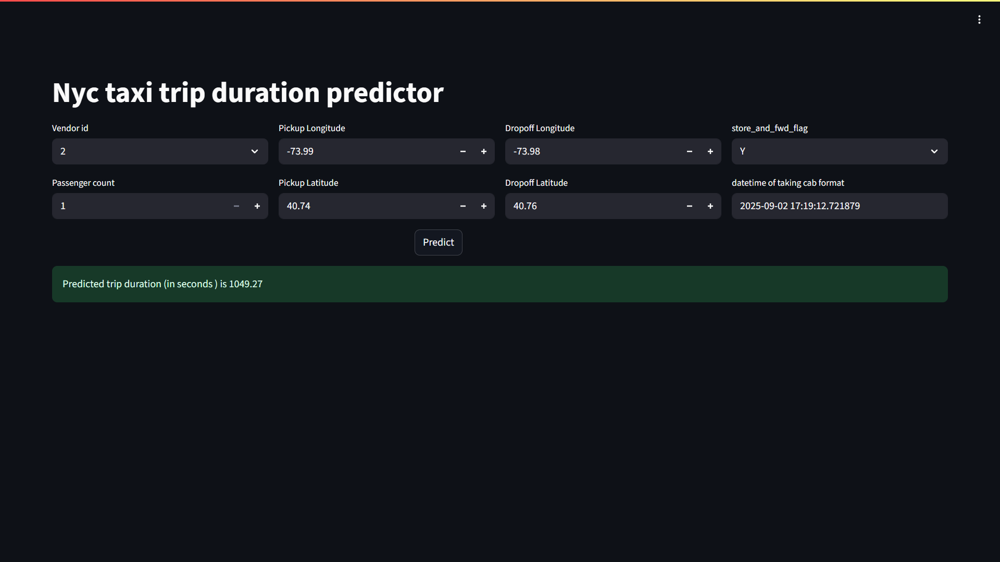

# 🚀 End-to-End ML Project with Full Automation

This repository contains a **fully automated ML system for predicting trip duration** that integrates data versioning, experiment tracking, CI/CD pipelines, containerized deployment, and a complete web application (Frontend + Backend).  

---

## ⚙️ Tech Stack & Tools

This project leverages a modern MLOps stack for **end-to-end automation**:  

- **CI/CD** → GitHub Actions (`.github/workflows/ci_cd.yml`)  
- **Cloud Deployment** → AWS (EC2, ECR)  
- **Pipeline Orchestration** → DVC (`dvc.yaml`, `params.yaml`)  
- **ML Models** → scikit-learn , XGboost, LightGBM , Catboost
- **Experiment Tracking** → MLflow (with CatBoost logs)  
- **Containerization** → Docker & Docker Compose  
- **Template Setup** → Cookiecutter project structure  
- **Backend API** → FastAPI + Pydantic  
- **Frontend UI** → Streamlit  
- **Automation** → GitHub Actions  

✅ This ensures **full reproducibility**, **versioned data/models**, **automated testing**, and **seamless deployment**.  

---

## 🔄 Workflow

1. **Data Versioning & Pipeline** → DVC manages all stages (preprocessing → training → model saving).  
2. **Experiment Tracking** → MLflow tracks metrics & artifacts.  
3. **Automation** → GitHub Actions trigger pipeline runs & deployments.  
4. **Containerization** → Docker ensures consistent environments.  
5. **Deployment** → Automated CI/CD pipeline deploys the latest model + app to AWS.  
6. **User Access** → Webapp (Streamlit Frontend + FastAPI Backend) for real-time predictions.  

---

## 🖼️ Project Preview  

  

---


---

## 📌 Key Highlights

- ✅ **End-to-End Automated** ML lifecycle  
- ✅ **Data + Model Versioning** with DVC  
- ✅ **Experiment Tracking** with MLflow  
- ✅ **CI/CD for Testing & Deployment**  
- ✅ **Cloud-Ready (AWS)**  
- ✅ **User-Friendly Webapp** (Streamlit + FastAPI)  

---


---

## 📢 Important Note

⚠️ The current model is trained on **20,000 rows only** due to cloud resource limitations.  
The full dataset contains **1.4 million rows**, which can be used when scaling up infrastructure.  

---
## 📂 Project Structure

```
├── .dvc/                   # DVC metadata
├── .dvcignore              # Ignore patterns for DVC
├── .github/workflows/      # GitHub Actions for CI/CD
│   └── ci_cd.yml
├── .gitignore              # Ignore patterns for Git
├── Makefile                # Automation commands
├── README.md               # Project documentation
├── compose.yaml            # Docker Compose for services
├── docs/                   # Documentation files
├── dvc.lock                # Lock file for DVC stages
├── dvc.yaml                # DVC pipeline definition
├── notebooks/              # Jupyter notebooks (EDA, modeling)
│   ├── 0_preprocessing.ipynb
│   ├── 1_EDA.ipynb
│   ├── 2_transformation.ipynb
│   ├── 3_model.ipynb
│   └── catboost_info/
├── params.yaml             # Pipeline parameters
├── pyproject.toml          # Project configuration
├── references/             # Reference data/resources
├── reports/                # Generated reports & figures
├── setup.cfg               # Python setup configuration
└── src/                    # Source code
    ├── Webapp/             # Frontend + Backend
    ├── dvc_pipeline/       # Modular ML pipeline scripts
    └── generate_report.py  # Automated report generation
```

## 🚀 Quick Start

### 1️⃣ Clone Repository
```bash
git clone https://github.com/your-username/your-repo.git
cd your-repo
```

### 2️⃣ Run Pipeline
```bash
dvc repro
```

### 3️⃣ Launch Application (Docker Compose)
```bash
docker compose up --build
```

### 4️⃣ Access Webapp
- **Frontend (Streamlit):** `http://localhost:8501`  
- **Backend (FastAPI):** `http://localhost:8000/docs`  